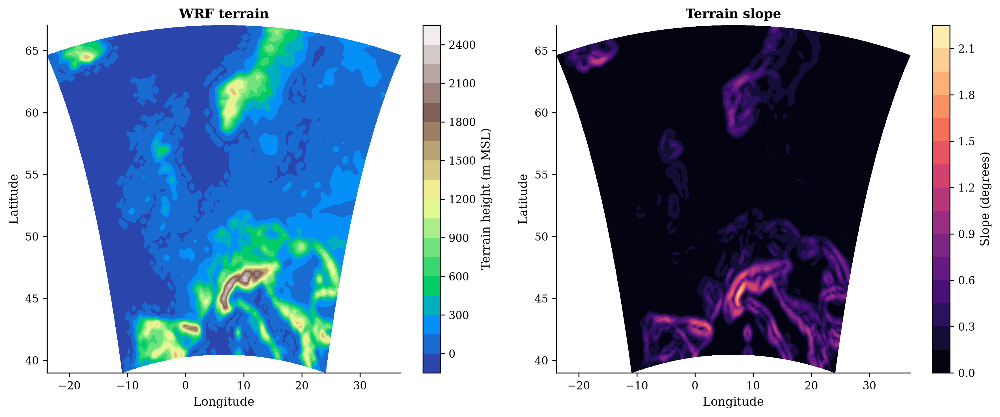
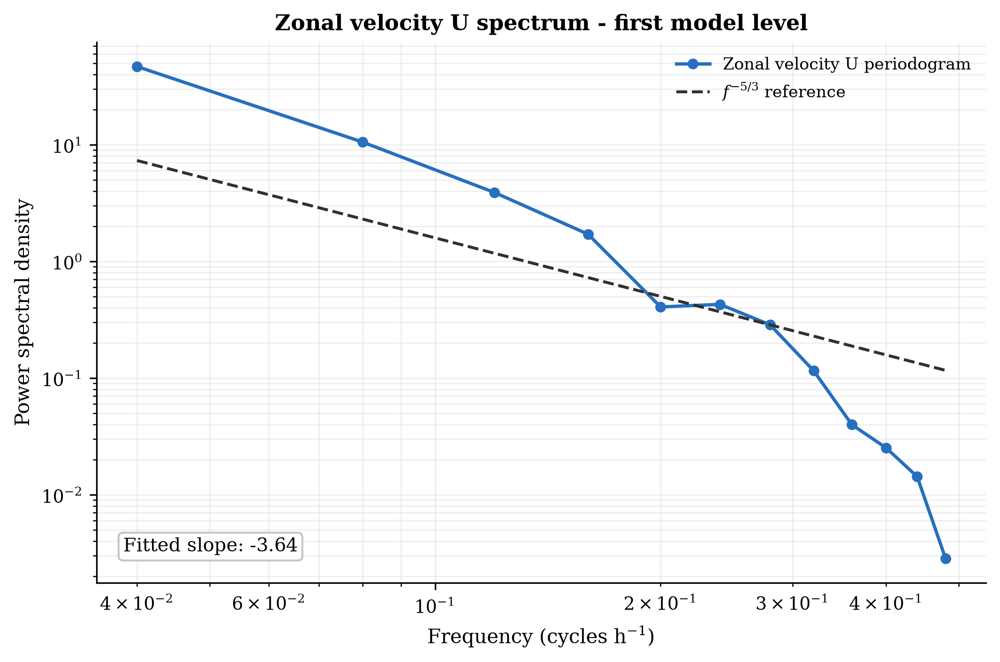
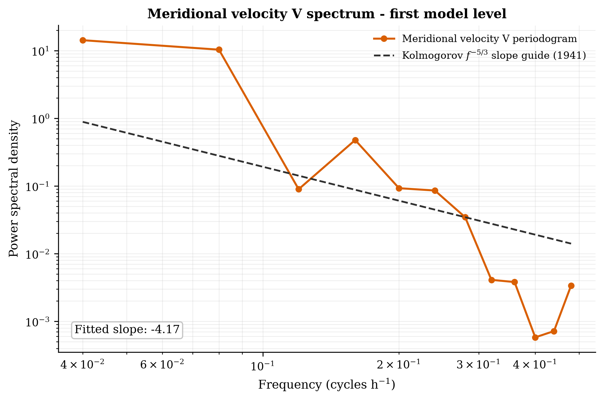
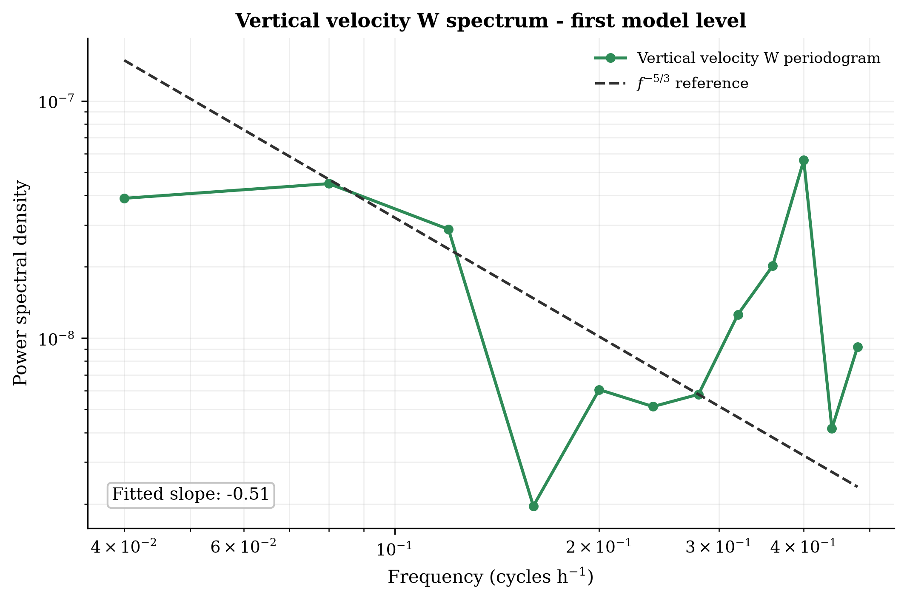

# WRF Tools

[](https://github.com/adithyavemuri/WRF_tools/actions/workflows/ci.yml)
[](https://www.python.org/)
[](LICENSE)
[](https://github.com/adithyavemuri/WRF_tools/releases/latest)

> **Scientific basis:** equations, assumptions, applicability limits, and
> primary references are documented in
> [Scientific methods and references](docs/SCIENTIFIC_METHODS.md).

WRF Tools is a cross-platform Python toolkit for reproducible post-processing
of Weather Research and Forecasting (WRF) model output. It brings WRF I/O,
meteorological diagnostics, WRF-LES turbulence analysis, spectral methods,
wind-energy workflows, visualization, quality control, and OpenFAST/TurbSim
coupling into one tested package.

> **Flagship workflow:** convert an extracted WRF-LES velocity plane into a
> TurbSim full-field (`.bts`) inflow file for OpenFAST, then validate the binary
> round trip before using it in a load simulation.

The project is designed for researchers and engineers who want reusable APIs
instead of one-off scripts. Functions accept general WRF datasets or
NumPy-compatible arrays wherever practical and avoid hard-coded domains,
locations, or machine paths.

> Status: beta. Users should independently validate diagnostics against the
> conventions of their WRF configuration before publication or operational use.

## Flagship: WRF-LES to TurbSim/OpenFAST

WRF Tools bridges atmospheric LES output and wind-turbine aeroelastic
simulation. It accepts the three WRF-LES velocity components in any declared
3-D axis order, maps them to OpenFAST's longitudinal/lateral/vertical
convention, writes the signed-16-bit TurbSim full-field format, reads the file
back, and checks its metadata and quantization error.

```bash
python examples/wrf_les_to_openfast.py \
  --u u_plane.npy --v v_plane.npy --w w_plane.npy \
  --output inflow.bts --dt 0.10 --dy 10 --dz 10 \
  --hub-height 120 --bottom-height 10

wrf-tools bts-info inflow.bts
```

The arrays in this example are `(time, vertical, lateral)`. Other layouts are
supported through explicit axis arguments. The workflow deliberately requires
the user to confirm plane orientation, wind rotation, component signs, spatial
spacing, time step, and rotor coverage; those choices cannot be inferred safely
from arbitrary WRF extraction products. See the
[complete flagship example](examples/wrf_les_to_openfast.py) and the
[scientific-methods ledger](docs/SCIENTIFIC_METHODS.md).

The binary convention is checked against the official
[OpenFAST Toolbox implementation](https://github.com/OpenFAST/openfast_toolbox/blob/main/openfast_toolbox/io/turbsim_file.py)
and the [TurbSim v2 User's Guide](https://openfast.readthedocs.io/en/v4.0.5/_downloads/cb14d3e2d3533d76e405d730fea19846/TurbSim_v2.00.pdf).

## Why use it?

- Analyze ordinary WRF and turbulence-resolving WRF-LES output.
- Process one file or a time-ordered sequence from the same WRF domain.
- Extract sites, profiles, planes, cross-sections, and interpolated levels.
- Run data-quality checks that report variables, values, and error locations.
- Calculate boundary-layer, thermodynamic, precipitation, terrain,
  turbulence, wind-resource, spectral, coherence, and temporal diagnostics.
- Convert WRF-LES velocity fields to TurbSim/OpenFAST inflow formats.
- Produce consistent publication-oriented plots and HTML/PDF reports.
- Use the same Python API and command line on Linux and Windows.

## Example output

The repository includes an anonymized report generated from a real WRF file:

- [Example PDF report](example_results/single_wrf_advanced/case_report.pdf)
- [Complete example script](examples/single_wrf_all_capabilities.py)



Component spectra use independent scales, fitted slopes, and normalized −5/3
references:

| U spectrum | V spectrum | W spectrum |
|---|---|---|
|  |  |  |

## Capabilities

| Area | Included functionality |
|---|---|
| WRF I/O | Discovery, inspection, validation, safe same-domain concatenation, variable access, provenance |
| Extraction | Geographic points/subsets, profiles, planes, cross-sections, requested-height interpolation |
| Grid and WPS | Destaggering, nearest cells, coordinate operations, eta levels, nested-domain validation |
| Meteorology | Wind, potential temperature, density, humidity, stability, precipitation, radar-rain conversion |
| Boundary layer | WRF PBLH analysis, threshold PBL diagnosis, stability classes, inversions, low-level jets |
| WRF-LES | Resolved fluxes, SGS stresses, resolved/SGS/total TKE, filtering, budget terms |
| Wind energy | Rotor-equivalent speed, shear, veer, turbulence intensity, Weibull fit, power density |
| Spectra | Periodogram, Welch PSD, cross-spectrum, coherence, radial spectra, slope fitting |
| Spatial analysis | Butterworth/top-hat filters, terrain metrics, regridding and conservation checks |
| Validation | Bias, MAE, RMSE, correlation, circular and normalized errors, Kantorovich distance |
| Plotting/reporting | Maps, barbs, profiles, sections, time-height plots, wind roses, JSON, HTML, PDF |
| OpenFAST/TurbSim | BTS/Bladed WND I/O, field operations, WRF-LES mapping, output/input processing |
| Observations | Generic mast, LiDAR, RADAR and SCADA tables; alignment and collocation |

See the [capability matrix](docs/CAPABILITY_MATRIX.md) and
[package expansion record](docs/PACKAGE_EXPANSION.md) for detailed coverage.
Equations, methodological limits, and primary references are catalogued in
[Scientific methods and references](docs/SCIENTIFIC_METHODS.md).

## Installation

Python 3.10-3.12 is recommended. Python 3.13 may not yet be supported by every
optional compiled dependency, particularly `wrf-python`.

### Linux or macOS

```bash
git clone https://github.com/adithyavemuri/WRF_tools.git
cd WRF_tools
python3 -m venv .venv
source .venv/bin/activate
python -m pip install --upgrade pip
python -m pip install -e ".[netcdf,science,plot,report]"
wrf-tools doctor
```

### Windows PowerShell

```powershell
git clone https://github.com/adithyavemuri/WRF_tools.git
cd WRF_tools
py -3.12 -m venv .venv
.\.venv\Scripts\Activate.ps1
python -m pip install --upgrade pip
python -m pip install -e ".[netcdf,science,plot,report]"
wrf-tools doctor
```

For dependency-file installation:

```bash
python -m pip install -r requirements.txt
python -m pip install -e . --no-deps
```

Native WRF diagnostics and Cartopy are separate because they can require
system libraries:

```bash
python -m pip install -r requirements-wrf.txt
```

Compiler and NetCDF prerequisites are in
[docs/PREREQUISITES.md](docs/PREREQUISITES.md).

## Quick start

### Inspect, validate, and open WRF output

```bash
wrf-tools inspect /data/wrf/wrfout_d01_2024-01-01_00_00_00
wrf-tools validate /data/wrf/wrfout_d01_2024-01-01_00_00_00
```

```python
from wrf_tools.io import discover_wrfout, open_wrf_sequence

files = discover_wrfout("/data/wrf/run", domain="d01")
with open_wrf_sequence(files) as ds:
    print(ds.sizes["Time"])
```

The sequence reader checks domain ID, grid dimensions, spacing, projection,
and time order. Mixed domains raise an error instead of being combined.

### Extract a site

```python
from wrf_tools.extract import point
from wrf_tools.io import open_wrf

with open_wrf("wrfout_d01_2024-01-01_00_00_00") as ds:
    site = point(ds, latitude=52.0, longitude=4.3,
                 variables=["T2", "U10", "V10"],
                 destagger_native=True)
    site.to_netcdf("site_timeseries.nc")
```

Generic extraction preserves the native WRF grid by default. For staggered
variables such as `U`, `V`, or `W`, request mass-grid values explicitly:

```python
from wrf_tools.io import get_variable

u_native = get_variable(ds, "U")
u_mass = get_variable(ds, "U", destagger_native=True)
```

The same `destagger_native` option is available on `point`,
`vertical_profile`, and `horizontal_plane`. Returned variables carry a
`wrf_tools_grid_processing` attribute, and destaggered output also records the
original dimensions in `wrf_tools_destaggered_dimensions`.

### Filtering and spectra

```python
from wrf_tools.filters import butterworth_spatial
from wrf_tools.spectra import radial_wavenumber_spectrum, welch_spectrum
from wrf_tools.wind_models import cheynet_spectrum

filtered = butterworth_spatial(
    u_plane, dx=50.0, dy=50.0,
    cutoff_wavelength=300.0, order=2,
)
frequency, psd = welch_spectrum(wind_series, sample_rate=2.0, nperseg=1200)
wavenumber, energy = radial_wavenumber_spectrum(u_plane, dx=50.0)
marine_psd = cheynet_spectrum(
    frequency, mean_speed=12.0, height=81.5,
    friction_velocity=0.45, stability=-0.2, component="u",
)
```

`cheynet_spectrum` implements the stability-dependent pointed-blunt marine
boundary-layer model of [Cheynet, Jakobsen and Reuder (2018)](https://doi.org/10.1007/s10546-018-0382-2),
using the author-supplied coefficient table at 81.5 m.

### Quality control and boundary-layer diagnostics

```python
from wrf_tools.quality import print_qc_report, quality_control
from wrf_tools.diagnostics import diagnose_pbl_height, low_level_jet

issues = quality_control(ds)
print_qc_report(issues)
pbl_height = diagnose_pbl_height(theta_v, height_agl, axis=1)
jet = low_level_jet(speed_profile, height_profile)
```

### WRF-LES to TurbSim/OpenFAST API

```python
from wrf_tools.coupling.openfast import (
    validate_bts, wind_field_from_components, write_bts,
)

field = wind_field_from_components(
    u_plane, v_plane, w_plane,
    time_axis=0, vertical_axis=1, lateral_axis=2,
    dy=10.0, dz=10.0, dt=0.1,
    hub_height=120.0, bottom_height=10.0,
)
write_bts("inflow.bts", field)
validate_bts("inflow.bts", expected=field)
```

`validate_bts` raises a descriptive error if dimensions, spacing, metadata, or
quantized velocities fail the round-trip tolerance. Successful serialization
does not establish that the LES inflow is physically suitable; consult the
coupling checklist in [Scientific methods](docs/SCIENTIFIC_METHODS.md).

## Run the complete example

The example takes its input, site, and output directory as arguments and has no
machine-specific paths:

```bash
python examples/single_wrf_all_capabilities.py \
  /data/wrf/wrfout_d01_2024-01-01_00_00_00 \
  --latitude 52.0 --longitude 4.3 \
  --output-dir example_results/my_case
```

It produces QC output, summaries, reusable arrays, publication-style figures,
a case report, and format round-trip checks. A short hourly file demonstrates
the spectral API but cannot resolve a true atmospheric inertial subrange; the
report states this limitation.

## Command line

```text
wrf-tools doctor [--core-only] [--json]
wrf-tools discover DIRECTORY [--domain d01] [--recursive]
wrf-tools inspect WRFOUT
wrf-tools validate WRFOUT
wrf-tools concat OUTPUT INPUT [INPUT ...]
wrf-tools extract WRFOUT OUTPUT LATITUDE LONGITUDE VARIABLE [VARIABLE ...] [--destagger]
wrf-tools filter INPUT.npy OUTPUT.npy --dx DX --cutoff WAVELENGTH
wrf-tools spectra INPUT.npy OUTPUT.npz --spacing DT
wrf-tools report WRFOUT report.json
wrf-tools bts-info inflow.bts
wrf-tools bts-compare first.bts second.bts
wrf-tools openfast-info simulation.outb
```

## Scope and limitations

- This is a post-processing package; it does not compile or configure WRF.
- Multi-file concatenation handles sequential files from one domain, not
  mixed-domain mosaics.
- WRF output files are not distributed with the repository.

## Development

```bash
python -m pip install -r requirements-dev.txt
python -m pip install -e . --no-deps
python -m pytest
python -m build
python -m twine check dist/*
```

Continuous integration tests Linux and Windows with Python 3.10 and 3.12. See
[CONTRIBUTING.md](CONTRIBUTING.md) before opening a pull request.

## License

WRF Tools is available under the [MIT License](LICENSE). WRF, OpenFAST,
TurbSim, and other named projects retain their respective licenses and
trademarks.
